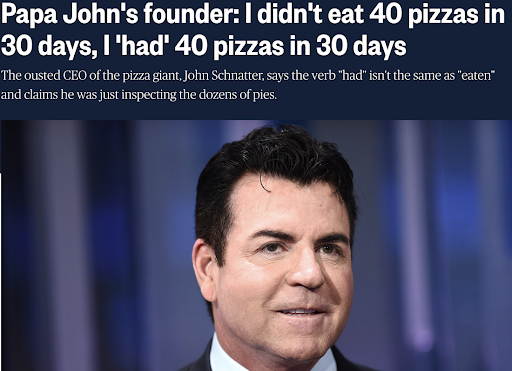
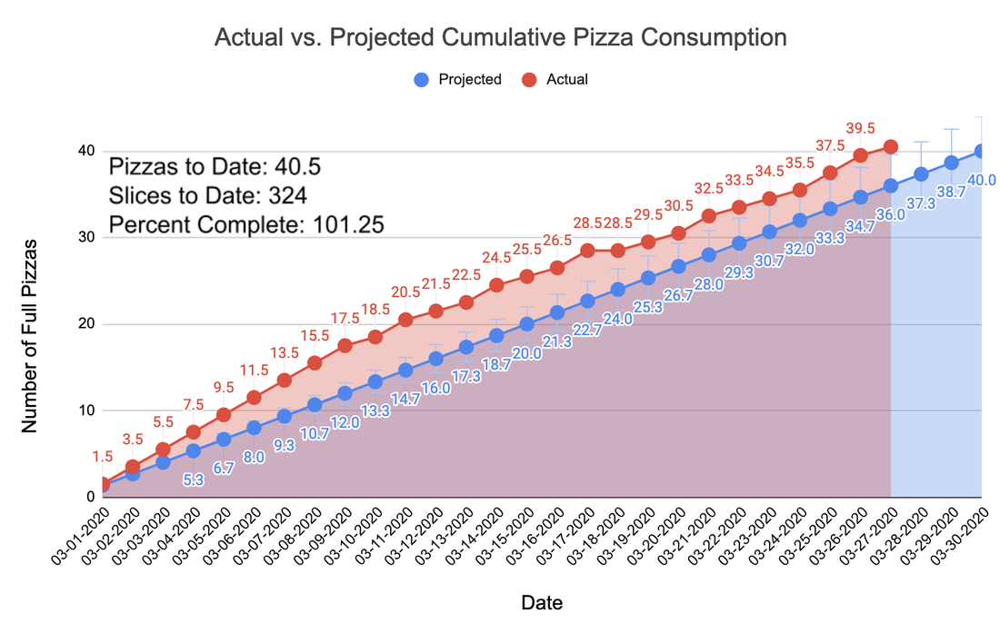
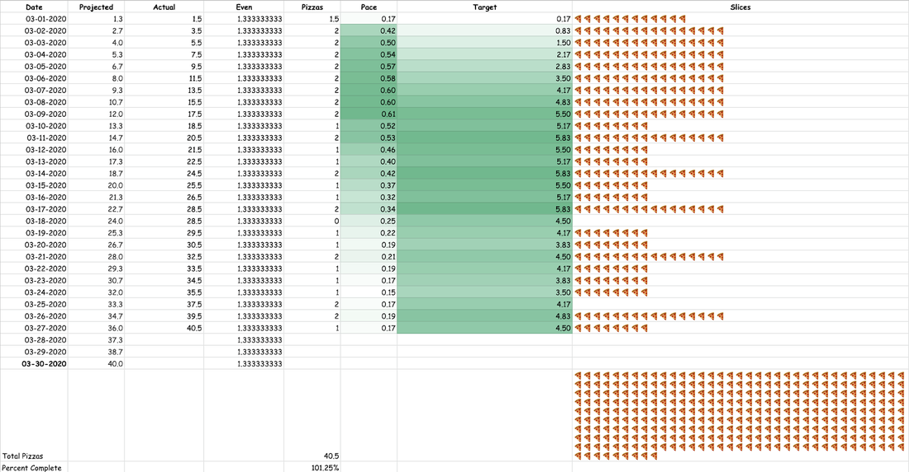

**TL;DR --** The latest “BodMod” competition has come to an end. An explanation of the Father Toilet 40 in 30 Pizza Challenge, where I ate 40 pizzas in 30 days, is below.

## Background

On November 27, 2019 I was having what my inner voice calls “the usual.” Sitting in the dining hall on campus with headphones on, I circumscribed my world to the cake, chicken sandwich, falafel burger, and 3 slices of pizza in front of me, as well as the company of my most inveterate Google group chat. Some of you know this chat as Dunce Analytics HQ. Years ago, during the Friendsgiving season, one member had produced an elaborate series of podcasts about making and eating pizza. In one episode he mentioned how Papa John’s Pizza was led by a racist clown, and quipped that “Papa John” is actually Italian for “Father Toilet.” Before arriving at the dining hall, someone had mentioned to me that Papa John’s Pizza might be closing, and so I stole the Father Toilet joke whole-hog, as if the faux translation had spontaneously occurred to me. I was reporting my perfidy to the Father Toilet progenitor when the news hit (the names have been changed to protect the identities of those involved):

**Bennett Slipski:** did you see that sweaty video of him?

**Adrian Easton:** yeah he gave a huge coked out interview that aired yesterday

**Adrian Easton:** he looked like the guy in the zombie movie that's been bitten by a zombie and tries to keep it a secret from the group

**Me:** Wait how do i watch

**Bennett Slipski:** <https://www.cnbc.com/2019/11/26/papa-johns-founder-says-the-pizza-tastes-different-after-eating-more-than-40-in-30-days.html>

To understand what follows, I urge you to watch the full 1 minute and 19 seconds of that [video clip](https://www.youtube.com/watch?v=bbfnu8tC1ms) The two main takeaways from the full John Schnatter interview are:

1.  He claims to have eaten 40 pizzas in 30 days

2.  Vaguely, “Stay tuned. The day of reckoning will come.”

Without realizing it, this omnisweating, degenerate pizza mogul had come up with the newest addition to a long (read: short) series of body modification competitions, which already included losing as much weight as possible in 5 days (The Hunger Games); drinking 24 beers and running 24 miles in under 24 hours (The 24/24/24/ Challenge); and transforming from as ugly to as hot of a body as possible in 1 month (The Hot Bod Competition). The best BodMod looks at what truly heinous, card carrying morons have already done and challenges nobodies like me to emulate them. So I tasked the best analyst over at Dunce Analytics with compiling a pizza dossier such that we could brainstorm 40 in 30 competition strategies. Taking an 8-slice medium Dominos za to be a standard pizza unit, they discovered that 40 pizzas would equate to:

- .07% of an acre of pizza

- At least 2300 calories of pizza per day Guaranteed death

- If all pizzas are Papa John's Medium Pepperoni, you will spend \$480 in pizza and \$3,500 in urgent care visits If you are gluten free you can do a 1:1 replacement of the crust with a nice hearty layer of jerky-and-velveeta, using this recipe!

- You can finally see life through the eyes of our wet, rotten-brained president

- If every pizza averages 30 pepperoni, then you will consume 5 lbs of salt and 40 lbs of assorted pig innards, also the pig was named Poppy and she had the cognitive abilities of a precocious 5th grader

- According to a sketchy google search this is the same amount of calories as drinking 2 gallons of gasoline, and only slightly less healthy

This all seemed extremely fine, and by early January the start date of the competition had been set to March 1, 2020, allowing for 2 full months of training. But then the unthinkable happened.

It turns out, the man does not have as much pizza experience as he led the public to believe. So what started as another unimportant BodMod competition became a different, and equally meaningless, political internet campaign to dethrone John “Papa John” Schnatter and claim the venerated title of Papa John as my own. ​

## Methods

Now, there used to be no reason to believe that training for an endurance pizza eating event should be anything like training for a long-distance running event. But it’s like they always say, when in Rome, stick to what you know. So in January and February I followed a training regimen resembling that of a novice marathon runner. This included eating 3 then 4 then 5 slices of za a day per week, followed by a rest week of only 2 slices per day. This preceded a series of 5 then 6 then 7 slice-a-day weeks. Finally, I dropped to 4 slices a day for the ‘peak week’ right before the competition. I’ve come to realize that this was a very paltry volume, given how the early stage of the competition would turn out.

I made the (faulty) assumption that pizza eating would get more and more difficult as time went on and decided to front-load my effort by eating 2 full pizzas a day for the first 9 days of competition. This put me well ahead of the 1.33 pizzas per day required for a perfectly even pace (Figure 1). I found myself with quite a bit of breathing room from this initial burst, and my analytics team informed me that I could relax to a 1 pizza per day pace for the rest of the month and still successfully complete the competition.The 1 za per day pace held pretty consistently until the final week of the competition, when I realized that if I completed two two-a-days in a row, I would be able to eat my 40th pizza on a Google hangout while drinking Olde English 40s on a Friday. Because #40Friday is one of my favorite long-standing friendship traditions, this was too good an opportunity to pass up.

Many people recommended that I track certain biometrics like blood pressure, heart rate, and sleep quality and create video blogs with the hope of getting noticed by some pizza chain or being gifted free pizza. While this is all good and funny, I just didn’t have the time for it. And ultimately, none of this is really for “the public”. It’s just another dumb thing to laugh about with my friends and to give me the sensation of accomplishment as we all move meaninglessly through time.

I catalogued nearly every pizza I ate in the 27 days it took me to eat 40 pizzas on my Instagram account. I tended to wait until the end of the day to post all the pictures of that day’s pizza, along with some political sounding snippets mainly comprising attacks on John Schnatter’s character, platitudes about a pluralistic pizza society, and brief vignettes to convey my moral superiority and qualifications to be Papa John. My personal favorite was:

Nobody should feel shame for eating pizza. Lately in the dining hall, covid has forced a change from self-serve stations to full service. I've been embarrassed to ask for 8 slices of Za at once, coming up with funny accents and wearing fake mustaches to disguise myself on multiple visits to the pizza area. But today I faced my fears and asked for a whole pizza on a plate. As Papa John, and unlike "Papa" [\@thepapajohnschnatter](https://www.instagram.com/thepapajohnschnatter/), you can expect me not to talk about it, but to be about it. Fortune flavors the bold. #LukeForPapa2020

All of these posts ended with the hashtag #LukeforPapa2020, which now houses all of my competition photos as well as a few pics from “fans”!

As a kind of weird addendum relating to how sweaty John Schnatter always appears to be, I announced that I would also lose weight while eating the 40 pizzas in 30 days. So I completed a weigh-in every Sunday night to track this progress. To this end, I began the competition with an excessive volume of exercise. I was completing about 2 hours of a vigorous mix of aerobic and anaerobic activity every day. This usually consisted of 60-90 minutes of intensive running or biking, which ended at the climbing gym for another 30-60 minutes of bouldering. All of this was on top of the usual 40 minutes of biking I complete every day between my lab and my house.

## Results

What should be the most concerning aspect of this experience is how easy it was. I in no way habituated to the pleasure of eating pizza. I still enjoyed the flavor of each pie by Day 27. I’m not really sure how long this could have gone on. At the same time, and despite my campaign rhetoric, this was not a healthy thing to do.

After eating 2 pizzas a day for 3 days I suffered a strange pavor nocturnus in which I was with my mom in an upstairs room looking out the window of our home in Ohio. People were rioting in the streets and looting our neighbors' houses. When we heard a crash downstairs I ran down to find a man had broken into our kitchen. As I was grappling with the assailant, I called upstairs desperately to warn my mom of the danger. At this moment, I woke up in my bed in New Hampshire and found that I was, in real life, screaming “MOMMMMM!” I do not recall having a nocturnal experience of this quality since puberty.

Perhaps interestingly, that same night I also remember waking up a few other times feeling sweaty (ring a bell?) and cold. In recounting this night in Gchats the next morning I mentioned that I wasn’t sure if these were symptoms of a deluge of pizza or of the cold/flu I was experiencing. It’s hard to say, but this also now sounds like I may have been a Corona Virus hipster, aliasing the signal of a global pandemic with gluttony.

Another salient mishap was during the week of March 16th, in which Dominos had a 50% off all pizzas sale. On the 17th I ate two Dominos pizzas for lunch, one after the other. The ramifications were recorded in my daily check-in spreadsheet and Gchats:

> I just ate 2 dominos pizzas and feel horrible. Yesterday I had a dominos pizza for lunch. I'm experiencing quite a bit of acid reflux. But now I can take tomorrow off and try to eat some dgmf vegetables.

> 2 dominoes is easily enough to kill someone. And might kill me yet. It basically put me down for the last 2.5 hours. And i still feel horrible. Gonna bike home and see if I can straight up provoke a heart attack. If my mom asks tell her something better happened, like I took up smoking cigarettes.

The next day I woke up with swelling under my left eye, which I speculate was due to the titanic amount of sodium in those two pizzas. As you can see in Table 1, the day after those 2 Dominos zas is the only day in which I did not eat any pizza. I was, for the first and only time during the competition, worried about the state of my body. Towards the end of the month, I did complete two two-a-days back to back, however these were all Digiorno pizzas, which straight up have less salt baked in, and they didn’t have the catastrophic consequences of a Dominos Daily Double.

After the first week of pizza eating (and excessive exercising), I had lost 2 pounds, going from 180 to 178 lbs. Recall that this was while eating 2 pizzas every day and exercising intensively for about 2 hours every day. At this point I was exhausted, but in the following week the pace dropped to a comfortable 1 pizza per day, during which time I went down to 173 lbs. In the third week, I was burnt out on exercise. I was only eating 1 pizza per day, but I was too tired to work off those calories and ended up gaining 2 pounds, ending the third week at 176 lbs. Finally, at the end of 30 days, the pizza eating was done and I had lost a total of 6 pounds to record a final weight of 174 lbs. I had done what John Schnatter couldn’t, and my body (at least from the outside) looked better for doing it.

In the days immediately following my last pizza, I felt a bit of anxiety, though this may have been work related. I also felt a little constipated, with some dull lower abdominal pain. Further, two nights after the end of pizza eating, I woke up in the night sweating and had strange dreams. This was actually quite similar to the night I woke up yelling for my mom, but this time I believe it was aggravated by the perceived similarity to Covid-19 symptoms. In the morning, I woke up feeling a bit more tired than usual but otherwise normal. Were these withdrawal symptoms? The world may never know.

## Discussion

Should people spend a month stuffing pizza down their hideous, sweaty maws? It seems unlikely.

However, as I have argued before and as I will continue to argue, our time in this wild hell world is limited, and our existence will ultimately be rendered meaningless by the incessant passage of time. All we have is the ephemeral meaning we make through our own machinations and “accomplishments”. For me, BodMod is easily one of the funniest meaning making tools available. See you later for the next one!

## Acknowledgments

A huge and, as always, heartfelt thank you to Nick, Kristen, Kerry, Andrew, and Nick’s other friends for being the only other people to admit that they thought this event was funny. Also to Lukas (VO) for donating about a day and a half of pizza to the cause.
