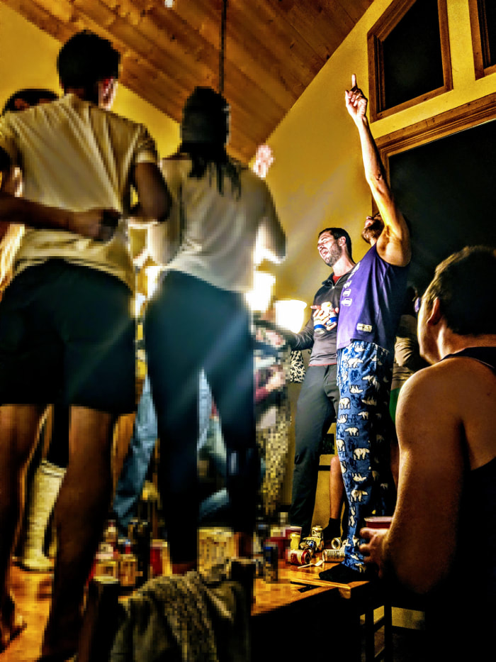

\

:::{.center}
{width=200; height=500}
:::

\

Historically, a power hour is a convivial event where a group of people listen to a playlist consisting of sixty, one-minute song clips and take a drink every time they hear the song change. Typically, mirth and scream-singing ensue. But power hour playlists can be so much more than a vessel for imbibing firewater. The playlist can be themed to fit a specific occasion. A power pop power hour can get you through a grueling and otherwise agonizingly monotonous spin session at the gym, where a regular playlist leaves you bored and restive halfway through each song. A road-trip-sing-along themed power hour can pep up a car full of listless friends in their second-to-last hour of a long trip after they've grown tired of podcasts and random song picks, but before the natural excitement of the last hour sets in. Power hours are the perfect solution when attention spans are low but the need for motivation is high. These playlists have brought me a ton of joy to build and listen to for over a decade. I hope you can browse the catalog and find something to celebrate to.

\

