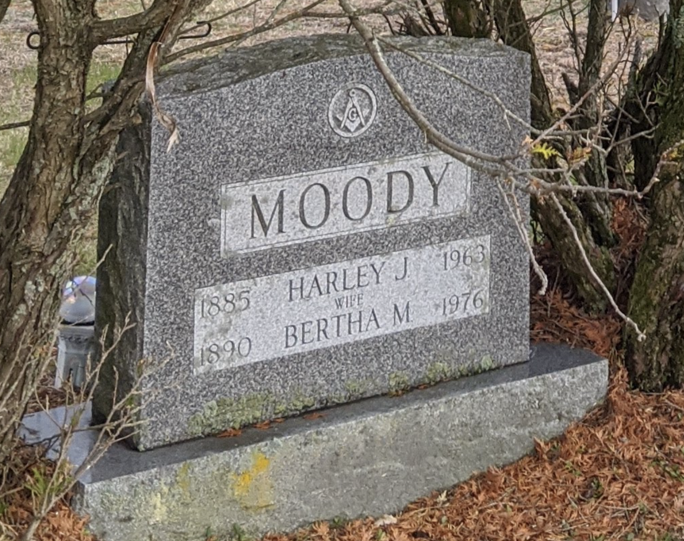

{width="200;" height="500"}\

**Run Time:** 55:46

**Songs:** 45

Taylor Swift is now a billionaire class traitor. Prior to her unapologetically sloppy and disappointing recent albums, she used to write a lot of songs about other people. The first half of this playlist is a tribute in memoriam to the careers of artists about whom Taylor has written songs. The second half of the playlist is pure, unadulterated Taylor bangers. I hope you love it.

A brief note on the pacing of this playlist is in order. I'll admit, I don't know exactly how to organize Taylor's music across the genres she's written in, and some of the song sequences reflect this uncertainty. At times during this hour I feel pulled in multiple directions with a building rhythmic chaos that ultimately resolves. Hopefully the pay off is worth it.

Forevermore yours,\
Luke

## Tunes

<iframe src="https://drive.google.com/file/d/1MuZxAJFAzHMFPzEEuEpfziBNq2VByCm3/preview" width="640" height="480">

</iframe>

## Spoilers

<iframe width="800px" height="700px" src="https://docs.google.com/spreadsheets/d/e/2PACX-1vSgWhhj8ZsMHnylMpx1yq_U3UWI7LyCs_-e92_lgKhOd3-foDVrIVTRiEsr5rnO6g/pubhtml?widget=true&amp;headers=false">

</iframe>
