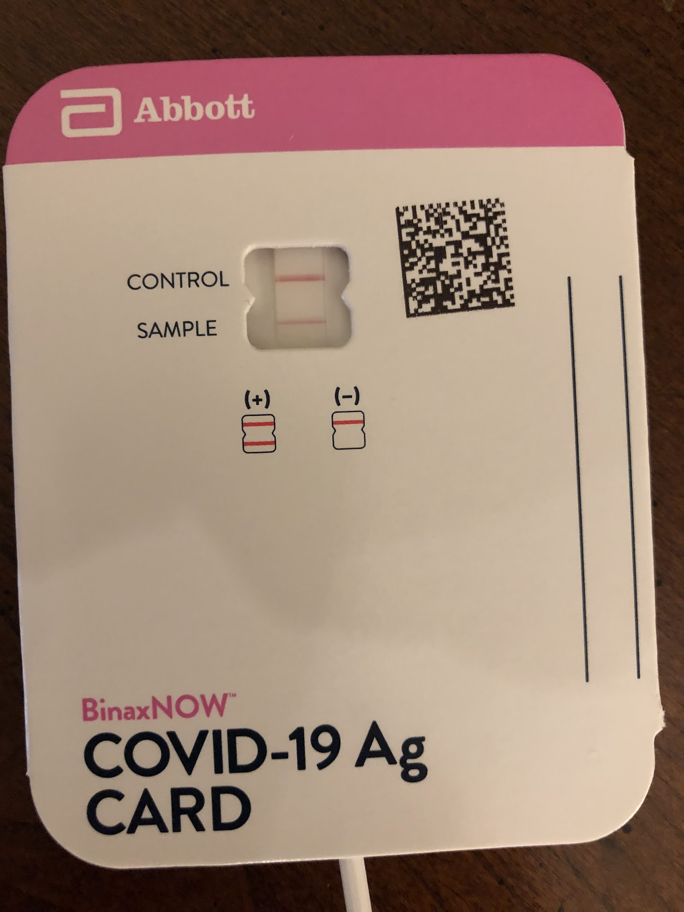

{width="200;" height="500"}

\

**Run time:** 1:01:25

**Songs:** 60

Content Warning: This playlist is expressly designed to make light of the COVID-19 pandemic.\

TL;DR -- Here’s a pandemic-themed power hour.\

Great (and mediocre!) musicians over many generations have given us the lyrics and melodies we need to capture the subtle flavors of solitude. This power hour includes songs about overwhelming weltschmerz, being sick of your roommates, transmitting viruses, feeling alone, working from home, having sex on the internet, managing anxiety, and reasons to drink. But it also includes songs about finding your breath, cultivating patience, enjoying time in your room, and dancing with yourself. It ends by looking out at the mess of the world and still finding some reason to not just die. Covid was the end of the world as we knew it (and we feel fine). 

Here I present to you Press Plague: The Malady Medley.

## Tunes

<iframe 
src="https://drive.google.com/file/d/1jLeYh_uG9HAB0PBkSoD9kykofhteGdGX/preview" 
width="640" 
height="480">
</iframe>

## Spoilers

<iframe 
width="800px" height="700px"
src="https://docs.google.com/spreadsheets/d/e/2PACX-1vQFuc2dJTTv6PHCYfqrLTPuv2tsJ5dF1qAFfQz27NmDdrCc7rMyXATZnbadUybKmA/pubhtml?widget=true&amp;headers=false">
</iframe>
